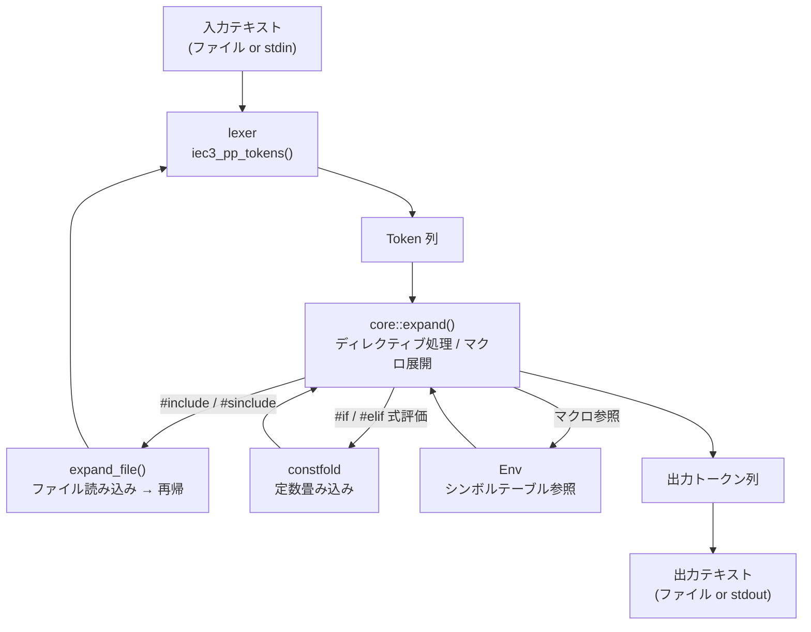

# Architecture / アーキテクチャ

## English Summary

Jiepp is a cross-platform IEC 61131-3 preprocessor written in C++23. It transforms IEC source files by handling directives such as `#define`, `#include`, `#if`/`#elif`/`#else`/`#endif`, function-like macros with variadic arguments, constant folding, and `#pragma`-style output. The architecture is layered into six tiers: **Loader** (lexer + directive parser), **Macro** (symbol expansion + built-in macros), **Core** (directive handling + include resolution + conditional compilation), **ConstFold** (compile-time expression evaluation via Flex/Bison), **Env** (environment split into Symtab/FileContext/Param mixins), and **CLI** (command-line interface + option parsing). The project builds on both Windows (Clang + Ninja) and Linux/WSL (Clang + Make) via CMake presets, with vcpkg managing dependencies (GoogleTest).

---

本ドキュメントは Jiepp の内部構造を開発者向けに説明します。

## プラットフォームとビルド

Jiepp は **Windows** および **Linux / WSL** のマルチプラットフォームに対応しています。CMake プリセットによりプラットフォームごとのコンパイラ・ビルドシステムの違いを吸収します。

| プラットフォーム | コンパイラ | ビルドシステム | 主なプリセット |
|----------------|-----------|--------------|---------------|
| Windows | Clang (`clang++`) | Ninja | `windows-clang-ninja-debug`, `windows-clang-ninja-release` |
| Linux / WSL | Clang (`clang++`) | Make | `linux-makefiles-debug`, `linux-makefiles-release` |
| Linux (サーバー配布) | Clang (`clang++`) | Make | `linux-portable-release` (完全静的リンク) |

### ビルド方法

**Windows (PowerShell):**

```powershell
git submodule update --init --recursive
.\vcpkg\bootstrap-vcpkg.bat -disableMetrics
cmake --workflow --preset windows-clang-ninja-debug      # Debug (configure + build + test)
cmake --workflow --preset windows-clang-ninja-release     # Release (ThinLTO)
```

**Linux / WSL:**

```bash
git submodule update --init --recursive
./vcpkg/bootstrap-vcpkg.sh -disableMetrics
cmake --workflow --preset linux-makefiles-debug           # Debug (configure + build + test)
cmake --workflow --preset linux-makefiles-release          # Release (ThinLTO)
cmake --workflow --preset linux-portable-release           # Release (完全静的リンク・サーバー配布向け)
```

`--workflow` は configure・build・test を一括実行します。個別に実行する場合:

```bash
cmake --preset <preset-name>          # configure
cmake --build --preset <preset-name>  # build
ctest --preset <preset-name>          # test
```

### 依存管理

外部依存は [vcpkg](https://github.com/microsoft/vcpkg) で管理しています。vcpkg は git サブモジュールとしてリポジトリに登録されており、`vcpkg.json` マニフェストで依存パッケージ（Google Test）を宣言します。`CMakePresets.json` の `CMAKE_TOOLCHAIN_FILE` が vcpkg ツールチェーンを自動設定します。

### 言語標準・コンパイラ要件

- **C++23** (`-std=c++23`)
- Clang 17 以上（Windows / Linux 共通）。公式プリセットは Clang を使用。Linux では GCC 13 以上でもビルド可能だが、プリセット外の手動設定が必要
- Release ビルドでは ThinLTO (`-O3 -flto=thin`) が有効
- `linux-portable-release` は `-static` で libc/libstdc++/libgcc を静的リンク

## モジュール構成

`src/` 配下は機能ごとにディレクトリに分かれています。

| ディレクトリ | 主なファイル | 役割 |
|-------------|-------------|------|
| `jiepp/` | `main.cpp`, `jiepp.hpp/cpp`, `option.hpp/cpp` | CLI エントリポイント。引数解析・前処理実行・入出力制御 |
| `env/` | `env.hpp/cpp`, `issue.hpp/cpp`, `issue_codes.def` | プリプロセッサ状態 (`Env`) の管理。`Env` は 3 つの Mixin 基底クラスの多重継承で構成される: `Symtab`（マクロシンボルテーブル, `symtab.hpp/cpp`）、`FileContext`（インクルードスタック・検索パス・行番号・依存関係追跡, `file_context.hpp/cpp`）、`Param`（リミット値・プラグマスタイル・トークンキャッシュ, `param.hpp/cpp`, `param_constants.hpp`）。エラー/イシュー出力 (`Issue`) も担当 |
| `loader/` | `lexer.hpp/cpp`, `token.hpp/cpp`, `directive_parser.hpp/cpp`, `directive_token.cpp`, `loader.hpp/cpp` | 入力テキストのトークン化・ディレクティブ解析。字句解析ヘルパー (`lexer_comment.cpp`, `lexer_pragma.cpp`, `lexer_literal.cpp`, `lexer_helpers.hpp/cpp`) および `.def` マクロ定義を含む |
| `core/` | `preprocessor.hpp/cpp`, `directive_handlers.cpp`, `expand.cpp`, `expand_ctrl.cpp`, `expand_subst.cpp` | プリプロセッサ本体。トークン列に対してディレクティブ処理・マクロ展開を行う。`expand_helpers.hpp`, `preprocessor_internal.hpp`, `builtin_macros.def` も含む |
| `macro/` | `macro.hpp/cpp` | `Macro` クラス。オブジェクト形式マクロ・関数形式マクロの定義を表現する |
| `constfold/` | `constfold.hpp/cpp`, `constfold_internal.hpp`, `constfold_scanner.cpp`, `constfold_parser.cpp` | `#if` / `#elif` 式の定数畳み込み評価。算術・比較・論理・ビット演算およびビットシフト (`<<`, `>>`) をサポート |

### CLI 構成

```
jiepp/
  main.cpp          — main() のみ。parse_args() を呼び jiepp_command() に委譲
  jiepp.hpp/cpp     — jiepp_command(): JieppOptions に基づく前処理の実行
  option.hpp/cpp    — JieppOptions 構造体 + DepMode enum + parse_args() + define_macro_option()
```

`jiepp_command` のシグネチャ:
```cpp
int jiepp_command(
    const JieppOptions& opts,
    std::ostream&       err,
    const std::string&  cwd = "");
```

`JieppOptions` は CLI オプションを集約した構造体:
```cpp
struct JieppOptions {
    std::vector<std::string> input_filepaths;
    std::optional<std::string> output_filepath;
    std::vector<std::string> define_macros;    // -D
    std::vector<std::string> undef_macros;     // -U
    std::vector<std::string> include_files;    // -include
    std::vector<std::string> syspaths;         // -I
    std::optional<int> max_include_depth;
    std::optional<int> max_expansion_depth;
    std::optional<int> max_if_nesting;
    std::optional<std::string> pp_output_pragma_style;
    std::optional<int> recursion_limit;
    bool remove_comments = false;              // -nC
    bool dM = false;                           // -dM
    bool silent = false;                       // --silent
    bool suppress_warnings = false;            // -w
    bool werror = false;                       // -Werror
    DepMode dep_mode = DepMode::NONE;          // -M / -MM
    std::optional<std::string> dep_file;       // -MF
    std::optional<std::string> dep_target;     // -MT
};
```

### constfold ディレクトリ構成

```
constfold/
  constfold.hpp             — 公開 API: eval_const_expr()
  constfold.cpp             — eval_const_expr 実装。生成された parser/scanner の定義をヘッダ経由で利用
  constfold_internal.hpp    — 型定義（TKind, CfTok, ValueKind, BitKind, CfValue, bit_mask）
  constfold.l               — Flex ソース → ビルド時に constfold_scanner.cpp を生成
  constfold.y               — Bison ソース → ビルド時に constfold_parser.cpp を生成
```

生成された constfold_scanner.cpp と constfold_parser.cpp は CMakeLists.txt の FLEX_TARGET / BISON_TARGET により生成され、`JIEPP_SOURCES` に追加される別の翻訳単位として処理されます。constfold.cpp は生成された parser ヘッダをインクルードして、パーサー機能を利用します。

演算子の優先順位は [`SPECIFICATION.md` §6.2](SPECIFICATION.md#62-演算子の優先順位--operator-precedence) を参照。

`__has_include` は `expand_ctrl.cpp` の `resolve_has_include()` でマクロ展開前に raw 文字列レベルで 1/0 に解決される。`"path"` 形式は INCLUDE 検索、`<path>` 形式は SINCLUDE 検索を使用。

### Issue Code X-macro

`src/env/issue_codes.def` に全エラーコードを定義。5フィールド X-macro パターン:

```cpp
// JIEPP_ISSUE_CODE(name, id, severity, message)
JIEPP_ISSUE_CODE(FILE_NOT_FOUND, 11, ERROR, "No such file or directory")
```

`Issue::Code` enum と `Issue::Severity` enum を生成。ID は `PP` + 2桁ゼロパディングで表示（例: `PP11`）。
番号帯でカテゴリをグループ化:

| 範囲 | カテゴリ |
|------|---------|
| 01–09 | System/Fatal |
| 10–19 | File/IO |
| 20–29 | Lexical/Syntax |
| 30–39 | Macro |
| 40–49 | Directive/Operand |
| 50–59 | Expression |
| 60–69 | Runtime/Limit |
| 70–79 | CLI/Option |
| 80–89 | （予約） |
| 90–99 | Message passthrough |

## 組み込みマクロの責務分離

GCC/cpp モデルに準拠し、組み込みマクロの定義責務をプリプロセッサとコンパイラで分離する。

| 責務 | マクロ例 | 定義元 | GCC での対応 |
|------|---------|--------|-------------|
| プリプロセッサ識別 | `_JIEPP`, `_JIEPP_VER` 等 | jiepp 自身 (`builtin_macros.def`) | `__GNUC__` — cpp 自身が定義 |
| ターゲット型情報 | `__SINT_MIN__`, `__UINT_MAX__` 等 | jiepp 自身 (`builtin_macros.def`) | `__SIZEOF_INT__` 等 — cpp が定義 |
| コンパイラ識別 | `_JIECC`, `_JIECC_VER` 等 | jiecc が `-D` で渡す | gcc が cpp を呼ぶ際に渡すフラグ |
| ベンダー固有 | `_OMRON` 等 | 呼び出し元が `-D` で渡す | ユーザー定義 (`-D`) |

**原則**: jiepp は「自分が何者か」だけを知り、「誰に呼ばれたか」は呼び出し元が教える。

## データフロー



### 処理の流れ（概略）

1. `jiepp/main.cpp` が `parse_args()` で引数を解析して `jiepp_command()` を呼ぶ
2. `jiepp_command()` が `Env` を構築し、`expand_file()` または `preprocess()` を呼ぶ
3. 入力は `lexer` でトークン化され `Token` 列になる
4. `core/expand.cpp` がトークン列を走査し:
   - ディレクティブ（`#define`, `#if` など）は `directive_parser` → `directive_handlers` が処理
   - `#include` / `#sinclude` は `expand_file()` が再帰的に読み込む
   - `#if` の条件式は `constfold` が評価（`__has_include` は事前に解決される）
   - マクロ参照は `Env` のシンボルテーブルを参照して展開
5. 出力トークン列をテキストに変換して書き出す（`output_filepath` が指定されていればファイルへ、なければ stdout へ）

## 主要な型・関数

| シンボル | 場所 | 概要 |
|---------|------|------|
| `Env` | `env/env.hpp` | プリプロセッサ全体の状態。マクロ辞書・インクルードスタック・パラメータを一元管理 |
| `Token` | `loader/token.hpp` | トークン 1 個を表す構造体 (`text`, `kind` など) |
| `Macro` | `macro/macro.hpp` | マクロ 1 件の定義（パラメータ一覧・本体トークン列） |
| `expand_file()` | `core/preprocessor.hpp` | `#include` / `#sinclude` の解決とファイル展開 |
| `preprocess()` | `core/preprocessor.hpp` | ストリームを受け取ってプリプロセス出力を書き出す主関数 |
| `expand()` | `core/preprocessor.hpp` | トークン列を展開して出力トークン列を返す |
| `eval_const_expr()` | `constfold/constfold.hpp` | `#if` 式文字列を評価して int64_t 値を返す |
| `Issue` | `env/issue.hpp` | エラー/イシュー発生時の出力・例外送出ユーティリティ。`-w` (警告抑制) / `-Werror` (警告→エラー昇格) サポート。`output()` は非スロー版出力メソッド |
| `jiepp_command()` | `jiepp/jiepp.hpp` | 前処理の実行エントリポイント |
| `parse_args()` | `jiepp/option.hpp` | CLI 引数解析 |

## サンドボックスモード (`JIEPP_SANDBOX`)

Web サーバー上で信頼できない入力を処理する場合に使用するコンパイル時セキュリティモード。
無効化されるディレクティブ・情報漏洩防止策・ランタイム制限の詳細は [`SPECIFICATION.md` §14](SPECIFICATION.md#14-サンドボックスモード--sandbox-mode) を参照。

### ビルド方法

任意のプリセットに `-DJIEPP_SANDBOX=ON` を追加します:

```powershell
# Windows (開発・テスト用)
cmake --preset windows-clang-ninja-debug -DJIEPP_SANDBOX=ON
cmake --build --preset windows-clang-ninja-debug
```

```bash
# Linux (サーバー配布用: 完全静的リンク + サンドボックス)
cmake --preset linux-portable-release -DJIEPP_SANDBOX=ON
cmake --build --preset linux-portable-release
```

### 設計方針

- **コンパイル時フラグ**: `#ifdef JIEPP_SANDBOX` で分岐。ランタイムオーバーヘッドなし
- **Process-per-request 必須**: flex/bison がグローバル状態を使用するため、リクエストごとにプロセスを起動する必要がある
- **入出力サイズ制限は呼び出し元で管理**: jiepp 本体ではなく PHP CGI (`jiecc.php`) 等が制限する

### テスト構成

`tests/` 配下は `src/` と同じモジュール構成:

| ディレクトリ | 内容 |
|-------------|------|
| `loader/` | 字句解析・トークン化・ディレクティブ解析のテスト |
| `macro/` | マクロ定義・展開のテスト |
| `core/` | プリプロセッサ統合テスト・サンドボックステスト |
| `constfold/` | 定数式評価のテスト |
| `env/` | 環境設定・エラー処理・ロバスト性制限のテスト |
| `jiepp/` | CLI 入出力・エンドツーエンドテスト |
| `support/` | テストユーティリティ・共通ヘルパー |

- `tests/env/test_robustness.cpp` — 常時有効なロバスト性制限のテスト
- `tests/core/test_sandbox.cpp` — サンドボックス固有テスト（`#ifdef JIEPP_SANDBOX` で囲まれ、通常ビルドではスキップ）